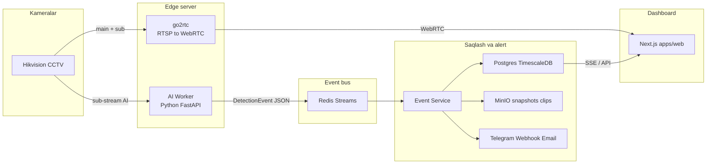
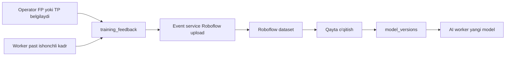

# AI Camera System — qanday ishlaydi

Bu hujjat loyihada **nima qilingani**, har bir **vazifa qanday bajarilishi** va qaysi **fayllar** javobgar ekanini tushuntiradi.

---

## 1. Loyiha nima?

**AI Camera System** — Hikvision CCTV kameralaridan real vaqtda video olib, sun'iy intellekt bilan tahlil qiladigan monitoring platformasi.

Aniqlay oladigan holatlar:

| Detektor | Vazifa |
|----------|--------|
| Odam | Kadrda odamni topish va `track_id` bilan kuzatish |
| Yong'in / tutun | Alanga yoki tutunni temporal filtr bilan tasdiqlash |
| Yiqilish | Tik/o'tirgan → yotgan o'tish + yerda qolish |
| Chekish (beta) | Sigaret + og'iz/qo'l geometriyasi |
| Demografiya | Jins + yosh guruhi (yosh / o'rta / yuqori) |

Bu **brauzer-demo emas**. Eski versiya telefonda kamerani ochib MediaPipe ishlatardi. Hozirgi tizim:

- serverda 24/7 ishlaydi
- Hikvision RTSP oqimini o'qiydi
- brauzer faqat dashboard (WebRTC + hodisalar)

---

## 2. Nima qilindi (xulosa)

| Bosqich | Natija |
|---------|--------|
| Monorepo | `apps/web`, `services/*`, `packages/types`, `infra` |
| Infra | Postgres+TimescaleDB, Redis, MinIO, go2rtc, Docker Compose |
| DB sxema | Multi-tenant, kameralar, zonalar, events, alertlar, audit |
| AI worker | RTSP → YOLO + ByteTrack → temporal qoidalar → Redis |
| Event service | Redis → Postgres + MinIO + Telegram/webhook + Roboflow |
| Dashboard | `/live`, `/events`, `/analytics`, `/cameras`, `/settings` |
| Auth / RBAC | Login, rollar, audit log, retention |
| SaaS asoslari | Tariflar, edge provisioning, PWA manifest |

---

## 3. Arxitektura oqimi



### Qisqa zanjir

1. Hikvision kamera RTSP beradi (`/Streaming/Channels/101` main, `102` sub).
2. **AI worker** sub-streamni o'qiydi (640×480 atrofida — GPU tejaydi).
3. Modelllar kadrni tahlil qiladi; temporal qoida tasdiqlasa → Redis Stream.
4. **Event service** xabarni oladi: snapshot/klipni MinIO ga yuklaydi, Postgres ga yozadi, alert yuboradi.
5. **go2rtc** brauzerga past kechikishli WebRTC video beradi.
6. **Next.js** operatorga live grid, hodisalar, analitika va sozlamalarni ko'rsatadi.

---

## 4. Papkalar va vazifalar

```
ai-camera-system/
  apps/web/                 # Next.js 16 dashboard (BFF)
  services/ai-worker/       # Python inference
  services/event-service/   # Persist + alert + Roboflow
  packages/types/           # Umumiy TypeScript shartnomalar
  infra/                    # docker-compose, SQL migratsiyalar, go2rtc.yaml
  scripts/                  # migrate, create-admin, camera-probe
  docs/                     # Shu hujjat
```

| Papka | Vazifa | Asosiy kirish |
|-------|--------|----------------|
| `apps/web` | UI, auth, API route'lar, go2rtc/WHEP proksi | `apps/web/app/` |
| `services/ai-worker` | RTSP decode, model, qoidalar | `app/main.py`, `app/pipeline/`, `app/rules/` |
| `services/event-service` | Redis consumer, MinIO, alert | `app/main.py`, `app/consumer.py` |
| `packages/types` | Event/kamera/alert/tenancy Zod schema | `src/events.ts`, `cameras.ts` |
| `infra` | Docker servislar + DB migratsiya | `docker-compose.yml`, `db/migrations/` |
| `scripts` | Admin yaratish, migrate, ISAPI probe | `create-admin.mjs`, `migrate.mjs` |

**Muhim:** Next.js **hech qachon** RTSP yoki AI ni o'zi bajarmaydi. U faqat BFF — DB o'qiydi va Python/go2rtc ga proksi qiladi.

---

## 5. Har bir detektor qanday ishlaydi

Barcha qoidalar bitta g'oyaga asoslangan: **bitta kadr = event emas**. Model "ko'rdi" deganda hali signal chiqmaydi; bir necha kadr davomida barqaror bo'lsa tasdiqlanadi (`app/rules/base.py` — `SlidingWindow`).

### 5.1 Odam aniqlash + tracking (poydevor)

| Narsa | Qiymat |
|-------|--------|
| Model | `person.pt` (YOLO, COCO) |
| Tracker | ByteTrack (`bytetrack.yaml`) |
| Kod | `pipeline/models.py`, `pipeline/runner.py` |

Har bir odamga `track_id` beriladi. Keyingi hodisalar (yiqilish, chekish, demografiya) shu ID ga bog'lanadi — kadrga emas.

### 5.2 Yong'in / tutun

| Narsa | Qiymat |
|-------|--------|
| Model | `fire_smoke.pt` (Roboflow fine-tune) |
| Kod | `rules/fire.py` |
| Temporal | ~4 s oynada kamida 5 ta hit |
| Fazoviy | Ketma-ket aniqlanishlar IoU bilan bir joyda bo'lishi kerak |

False positive manbalari: quyosh nuri, chiroq aksi, qizil kiyim. Shuning uchun vaqt + joy filtrlari majburiy.

### 5.3 Yiqilish

| Narsa | Qiymat |
|-------|--------|
| Model | `pose.pt` (YOLO11-pose, 17 keypoint) |
| Kod | `rules/fall.py` |

**Statik "yotgan" = yiqilish emas.** Uch shart:

1. Odam avval tik yoki o'tirgan edi
2. Qisqa vaqtda (< ~2 s) gorizontal holatga o'tdi
3. Yerda qoldi (>= ~3 s)

Aks holda egilish, o'tirish yoki yotish yolg'on signal beradi.

### 5.4 Chekish (beta)

| Narsa | Qiymat |
|-------|--------|
| Model | `cigarette.pt` |
| Kod | `rules/smoking.py`, `pipeline/mediapipe_face.py` |
| Temporal | ~6 s / 6 hit |

Uch qatlam:

1. YOLO sigaret / smoking klassi
2. Geometriya — sigaret og'iz yoki bilak yonida (pose keypoints; yaqin masofada ixtiyoriy MediaPipe FaceMesh)
3. Temporal ovoz berish

Sigaret kichik obyekt — aniqlik ilmiy maqolalarda ham 72–84%. UI da **beta** deb belgilanadi.

### 5.5 Demografiya (jins va yosh)

| Narsa | Qiymat |
|-------|--------|
| Modellar | `face.pt`, `genderage.onnx` |
| Kod | `rules/demographics.py`, `pipeline/face.py` |
| Yosh | Faqat 3 guruh: `young` (0–25), `middle` (26–50), `senior` (51+) |

**Aniq yosh berilmaydi** (ochiq modellarda MAE ~7.5 yil). Yuz embeddingi **saqlanmaydi** — faqat agregat atributlar `person_sightings` jadvaliga yoziladi.

> Litsenziya: InsightFace pretrained paketlari tijorat uchun yaroqsiz. Sotiladigan mahsulotda o'z modelingizni ochiq datasetda o'qiting.

### Model fayllari

Joy: `services/ai-worker/models/`

Fayl yo'q bo'lsa — tegishli detektor o'chadi, worker ishdan chiqmaydi. Holat `/status` da ko'rinadi.

---

## 6. Dashboard sahifalari

| Yo'l | Vazifa | Asosiy fayllar |
|------|--------|----------------|
| `/login` | Kirish | `app/login/` |
| `/live` | WebRTC kamera grid + jonli AI box (odam/olov) + so'nggi hodisa | `live/page.tsx`, `LiveGrid.tsx`, `WebRtcPlayer.tsx`, `DetectionOverlay.tsx` |
| `/events` | SSE lenta, snapshot/klip, status, false-positive | `events/page.tsx`, `EventFeed.tsx`, `api/events/` |
| `/analytics` | Tendensiya, demografiya, FP ulushi, soatlik tashrif | `analytics/page.tsx`, `lib/data/analytics.ts` |
| `/cameras` | ISAPI probe, CRUD, detektor tanlash | `cameras/page.tsx`, `CameraForm.tsx` |
| `/cameras/[id]` | Bitta kamera live + zona editori | `ZoneEditor.tsx` |
| `/settings` | Alertlar, users, models, edge, billing, audit | `settings/page.tsx`, `SettingsPanels.tsx` |

### Kamera qo'shilganda nima bo'ladi

1. ISAPI orqali login/parol va sub-stream tekshiriladi (`lib/services/hikvision.ts`)
2. Parol AES-GCM bilan shifrlanib DB ga yoziladi
3. go2rtc ga main + sub oqimlar ro'yxatdan o'tkaziladi
4. AI worker `/reload` chaqiriladi — yangi kamera loopga qo'shiladi

---

## 7. Ma'lumotlar modeli

Migratsiyalar: `infra/db/migrations/`

| Jadval | Vazifa |
|--------|--------|
| `organizations` | Multi-tenant ildiz, tarif, kamera limiti |
| `sites` | Obyektlar (do'kon, filial) |
| `users` / `memberships` / `sessions` | Auth + RBAC |
| `cameras` | RTSP host, kanal, shifrlangan parol, `enabled_detectors` |
| `detection_zones` | Normallashtirilgan (0..1) poligonlar |
| `events` | TimescaleDB hypertable — asosiy hodisalar |
| `person_sightings` | Demografiya agregatlari |
| `training_feedback` | Active learning navbati |
| `alert_rules` / `alert_deliveries` | Alert konfiguratsiya va tarix |
| `model_versions` | Model registry |
| `edge_nodes` | Edge box provisioning |
| `audit_log` | Kim nima qildi / qaysi videoni ko'rdi |

Event statuslari: `new` → `acknowledged` → `resolved` yoki `false_positive`.

---

## 8. Active learning qanday ishlaydi



1. Operator `/events` da "yolg'on signal" yoki tasdiqlash bosadi
2. `queueFeedback` snapshot kalitini `training_feedback` ga yozadi
3. Event service fon vazifasi Roboflow ga yuklaydi (`ROBOFLOW_API_KEY` bo'lsa)
4. Qayta o'qitilgan model `model_versions` ga yoziladi va faollashtiriladi

Bu halqa mahsulotning asosiy raqobat ustunligi: model **mijozning o'z kameralarida** yaxshilanadi.

---

## 9. Alertlar

Sozlamalar → Alertlar:

- Kanallar: Telegram, webhook (HMAC imzo), email (SMTP)
- Filtr: event turi, minimal severity, cooldown, faol soat oralig'i
- Kod: `services/event-service/app/alerts.py`, `apps/web/lib/data/alerts.ts`

Bir xil kamera + event turi uchun cooldown spamni to'xtatadi.

---

## 10. Ishga tushirish bosqichlari

```bash
# 1. Muhit
cp .env.example .env
# AUTH_SECRET (>=32), CREDENTIALS_ENCRYPTION_KEY (32 bayt base64),
# POSTGRES_PASSWORD, S3_SECRET_KEY, AI_WORKER_TOKEN ni to'ldiring

# 2. Paketlar
npm install

# 3. Infra
npm run infra:up

# 4. Migratsiya
npm run db:migrate

# 5. Admin
npm run create-admin -- --email admin@example.com --password '...' --org "Demo"

# 6. Modellar
# services/ai-worker/models/ ga person.pt, pose.pt, ... qo'ying

# 7. Dashboard
npm run dev
# http://localhost:3000
```

| Buyruq | Vazifa |
|--------|--------|
| `npm run infra:up` | Postgres, Redis, MinIO, go2rtc, workers |
| `npm run infra:down` | To'xtatish |
| `npm run db:migrate` | SQL migratsiyalar |
| `npm run create-admin` | Birinchi foydalanuvchi + org |
| `npm run camera:probe` | Hikvision ISAPI tekshiruv |
| `npm run dev` | Next.js |

Portlar: web `3000`, AI worker `8000`, event-service `8001`, Postgres `5432`, Redis `6379`, MinIO `9000`, go2rtc `1984`.

---

## 11. Rollar va ruxsatlar

| Rol | Asosan nima qila oladi |
|-----|------------------------|
| `viewer` | Ko'rish (live, events, analytics) |
| `operator` | + acknowledge, false-positive belgilash |
| `manager` | + kamera/alert yozish, user o'qish, audit |
| `owner` | Hammasi + billing, user yozish |

Kod: `packages/types/src/tenancy.ts`, `apps/web/lib/auth/guard.ts`.

---

## 12. Muhim cheklovlar

1. **Brauzer RTSP o'qiy olmaydi** — go2rtc majburiy.
2. **AI brauzerda emas** — brauzer yopilsa ham monitoring davom etadi (worker serverda).
3. **Model fayllarisiz** detektorlar ishlamaydi — faqat mavjudlari yoqiladi.
4. **CPU** — 1–2 kamera, faqat person; fall/demographics uchun GPU tavsiya.
5. **GPU sig'im** (taxminan, barcha detektorlar): 1 o'rta GPU ≈ 8–12 kamera @ ~6 fps.
6. **Biometriya** — embedding saqlanmasin; ma'lumot O'zbekiston serverida bo'lishi kerak.
7. **Chekish** — beta; mijozga "100% aniq" deb va'da qilmang.
8. **Sub-stream** — AI uchun 640×480 H.264; 1080p sub GPU ni behuda yeydi.

---

## 13. Fayl bo'yicha tezkor indeks

| Vazifa | Fayl |
|--------|------|
| Event JSON shartnoma | `packages/types/src/events.ts` ↔ `services/ai-worker/app/schemas.py` |
| Kadr loop | `services/ai-worker/app/pipeline/runner.py` |
| Temporal qoidalar | `services/ai-worker/app/rules/*.py` |
| Redis publish | `services/ai-worker/app/bus.py` |
| Redis consume | `services/event-service/app/consumer.py` |
| Alert yuborish | `services/event-service/app/alerts.py` |
| Roboflow upload | `services/event-service/app/roboflow.py` |
| Media retention | `services/event-service/app/retention.py` |
| WebRTC player | `apps/web/components/live/WebRtcPlayer.tsx` |
| WHEP proksi | `apps/web/app/api/streams/[cameraId]/whep/route.ts` |
| Live overlay SSE | `apps/web/app/api/streams/[cameraId]/overlay/route.ts` |
| SSE hodisalar | `apps/web/app/api/events/stream/route.ts` |
| go2rtc register | `apps/web/lib/services/go2rtc.ts` |
| Kamera CRUD | `apps/web/lib/data/cameras.ts`, `cameras/actions.ts` |
| Docker stack | `infra/docker-compose.yml` |

---

## 14. Keyingi qadamlar (operatsion)

1. `.env` ni to'ldirish va `infra:up` + `db:migrate` + `create-admin`
2. Hikvision sub-stream ni 640×480 H.264 qilish
3. `person.pt` / `pose.pt` qo'yib bir kamera bilan `/live` va `/events` ni tekshirish
4. Roboflow da fire/smoking dataset + o'z CCTV kadrlari bilan fine-tune
5. Telegram alert qoidasini sozlash
6. False-positive belgilab active learning halqasini ochish

Savollar bo'lsa — shu hujjat + root `README.md` + `services/ai-worker/README.md` ni birga o'qing.
